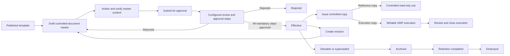
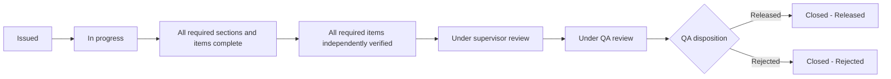

# DocuPharma DMS Process Workflow Guide

Application-aligned guide for controlled-document masters, approvals, controlled-copy issuance, GMP execution records, revisions, and retention.

## 1. Purpose and scope

This guide applies to the DocuPharma Document Management System (DMS) and covers:

- document templates and controlled-document masters;
- SOP, policy, manual, form, log, checklist, BMR, BPR, report, protocol, specification, validation, and annexure documents;
- document review and approval;
- reference-copy and writable execution-copy issuance;
- execution, independent verification, supervisor review, and QA disposition;
- revision, supersession, obsolescence, archival, retention completion, and destruction.

Quality events such as deviations, CAPAs, change controls, incidents, audits, and inspections can be represented as controlled documents, but their operational QMS lifecycles are managed in the corresponding QMS resources.

## 2. Roles and responsibilities

| Role | Main responsibilities |
|---|---|
| SOP Maker | Create and edit templates and draft controlled documents; submit documents; create revisions. |
| SOP Checker | Review assigned document-approval steps and record approval decisions. |
| SOP Approver | Perform final or assigned approval steps. |
| Document Controller | Publish templates; issue, recall, and destroy controlled copies; manage controlled PDF access; administer retention. |
| GMP Record Executor / Log Maker | Enter issued-copy data, complete sections, and submit execution records. |
| Production Supervisor | Independently review completed execution records when required. |
| QA Reviewer | Review/approve controlled documents and perform final QA disposition for BMR/BPR executions. |
| SOP Administrator | Administer DMS configuration, permissions, and all DMS operations. |

An organization may assign equivalent job titles, but users must have the corresponding application permissions.

## 3. End-to-end DMS lifecycle

### 3.1 Master-document status flow

| Status | Meaning | Normal next action |
|---|---|---|
| Draft | Editable authoring version. | Complete the master and submit for approval. |
| Under review | Approval workflow is active; editing is locked. | Assigned reviewers approve, return, or reject. |
| Approved | One or more steps are approved, but mandatory approval may still be outstanding. | Complete remaining mandatory steps. |
| Effective | Fully approved active version. | Issue controlled copies or create a revision. |
| Rejected | Approval was rejected. | Follow the organization’s correction/recreation procedure. |
| Superseded | A newer version in the same document series became effective. | Archive after operational withdrawal is complete. |
| Obsolete | Withdrawn without replacement or no longer applicable. | Archive. |
| Archived | Preserved for the defined retention period. | Complete retention when the period expires. |
| Retention completed | Retention obligations are complete. | Destroy with an approved reason. |
| Destroyed | Final lifecycle state. | No further use. |

## 4. Document-type workflow matrix

| Type | Code | Format | Effective SOP reference required | Issued copy | Execution controls |
|---|---|---|---|---|---|
| Standard Operating Procedure | SOP | Text document | No | Reference | No writable execution record. |
| Policy | POLICY | Text document | No | Reference | No writable execution record. |
| Manual | MANUAL | Text document | No | Reference | No writable execution record. |
| Controlled Form | FORM | Controlled form | Yes | Reference or execution | Complete required fields/sections; closes directly unless configuration overrides the default. |
| Log Document | LOG | Repeating log | Yes | Reference or execution | Scheduled/repeated entries; supervisor review required. |
| Checklist | CHECKLIST | Checklist | Yes | Reference or execution | Required responses, independent item verification, and supervisor review. |
| Batch Manufacturing Record | BMR | Controlled form | Yes | Reference or execution | Independent item verification, supervisor review, QA approval, material reconciliation, and final disposition. |
| Batch Packaging Record | BPR | Controlled form | Yes | Reference or execution | Same controlled execution path as BMR. |
| Report | REPORT | Structured table | Yes | Reference | Approved report is controlled as a read-only copy; no execution record. |
| Protocol | PROTOCOL | Structured table | Yes | Reference | Approved protocol master is issued read-only; execution evidence should be captured in the configured execution/QMS record. |
| Specification | SPEC | Structured table | Yes | Reference | Controlled acceptance criteria/reference document. |
| Validation | VALIDATION | Structured table | Yes | Reference | Controlled validation/qualification document. |
| Annexure | ANNEXURE | Attachment package | Yes | Reference | Controlled supporting evidence package. |

All listed types are configured as issuable. A writable execution copy is available only when the type’s format requires an execution record: FORM, LOG, CHECKLIST, BMR, and BPR.

### 4.1 Additional configured controlled-document codes

| Type | Code | DMS behavior |
|---|---|---|
| Change Control | CHANGE_CONTROL | Text/reference controlled document requiring an effective SOP reference. Operational decisions belong to the QMS Change Control resource. |
| Corrective and Preventive Action | CAPA | Text/reference controlled document requiring an effective SOP reference. CAPA implementation/effectiveness is managed in QMS. |
| Deviation | DEV | Text/reference controlled document requiring an effective SOP reference. Deviation investigation and disposition are managed in QMS. |
| Incident | INCIDENT | Text/reference controlled document requiring an effective SOP reference. |
| Audit | AUDIT | Text/reference controlled document requiring an effective SOP reference. Audit scheduling/findings are managed in QMS. |
| Inspection | INSPECTION | Text/reference controlled document requiring an effective SOP reference. |
| Test | TEST | Text/reference controlled document requiring an effective SOP reference. |
| Training | TRAINING | Text/reference controlled document requiring an effective SOP reference. Training assignment/completion may be managed by the applicable training process. |
| Other | OTHER | General text/reference controlled document requiring an effective SOP reference. |

These codes follow the common controlled-master approval, reference issuance, revision, and retention workflow when used in DMS. They do not create writable Document Execution records unless their configuration is deliberately changed.

## 5. Common master-document process

### Step 1: Select or prepare a template

1. Open **DMS → Document Templates**.
2. Select a published template for the required document type.
3. If a suitable template does not exist, create and approve/publish one before generating the controlled document.

### Step 2: Create the controlled-document master

1. Open **DMS → Controlled Documents** and create the document from the selected template.
2. Enter the title, department, category, owner, effective/review dates, and required variables.
3. For every document type except SOP, POLICY, and MANUAL, select an effective referenced SOP when the type requires one.
4. Confirm the generated document number and version.

### Step 3: Author the master

1. Keep the document in **Draft** while editing.
2. Complete each section’s controlled content.
3. For structured tables and checklists, define at least one **Execution field** in every section that captures execution data.
4. For repeating logs, select the logging frequency and period when issuing the writable copy.
5. Add acceptance limits, units, required flags, and verification requirements where applicable.
6. Review attachments, regulation tags, references, and organization data.

Master execution fields define what must be captured but remain blank. Actual observations, readings, initials, and responses belong to an issued execution copy, not the master.

### Step 4: Pre-submission check

Before selecting **Submit for Approval**, verify:

- the document is still Draft;
- required metadata and references are complete;
- at least one master section exists;
- every required table/checklist section contains execution fields;
- no execution responses have been entered in the master;
- the correct department approval workflow is active.

### Step 5: Submit and approve

1. Select **Submit for Approval** and confirm.
2. The document changes to **Under review** and editing is locked.
3. Assigned reviewers act from the approval queue.
4. Each decision is electronically attributed and audit logged.
5. A reviewer may:
   - **Approve**: advance/complete the required approval path;
   - **Return**: send the document back to Draft for correction;
   - **Reject**: place the document in Rejected status.
6. When all mandatory steps are approved, the document becomes **Effective**. A prior effective version in the same series becomes **Superseded**.

## 6. Type-specific master guidance

### 6.1 SOP

Use for controlled procedural instructions.

Recommended sections: purpose, scope, responsibilities, definitions, procedure, records, references, revision history, and approvals.

Workflow: **Draft → Under review → Effective → Revision/Superseded → Archived → Retention completed → Destroyed**.

SOPs do not require another SOP reference. Issue them as controlled reference copies.

### 6.2 Policy

Use for management intent, governance, and mandatory organizational principles.

Recommended sections: purpose, scope, policy statements, responsibilities, governance, exceptions, and references.

Use the common approval and reference-copy workflow. Policies do not require an SOP reference.

### 6.3 Manual

Use for a collection of related controlled topics, such as a quality manual.

Recommended sections: organization/context, system description, responsibilities, process interactions, controlled references, and appendices.

Use the common approval and reference-copy workflow. Manuals do not require an SOP reference.

### 6.4 Controlled Form

Use as a blank GMP data-capture master.

The master must define each required issued-copy field. After approval, issue an **Execution** copy when users must enter data, or a **Reference** copy for read-only use.

Default execution flow: **Issued → In progress → Closed**.

### 6.5 Log Document

Use for repeated entries such as temperature, cleaning, equipment, or maintenance logs.

At issuance, provide the log frequency and period when scheduled entries are needed. The system can generate hourly, shift, or daily entries.

Default execution flow: **Issued → In progress → Under supervisor review → Closed**.

The reviewer must be different from the person who completed the log.

### 6.6 Checklist

Use for controlled pass/fail/N/A checks.

Define each check as an execution field and mark required checks. Use **Pass / Fail** for controlled checklist decisions. N/A responses require an explanation.

Default execution flow: **Issued → In progress → Independent item verification → Under supervisor review → Closed**.

The verifier must be different from the person who completed the item.

### 6.7 BMR and BPR

Use BMR for manufacturing and BPR for packaging batch execution.

The master should define:

- batch and product fields;
- material/component and reconciliation requirements;
- ordered manufacturing or packaging steps;
- critical checks and independent verification;
- yield, deviation, and review information;
- production and QA approvals.

Default execution flow:

Controls:

- each required execution item must contain a response;
- required items must be independently verified;
- every required section must be completed;
- the supervisor reviewer must differ from the executor;
- materials must contain planned and actual quantities and must reconcile before QA disposition;
- the QA approver must differ from both the executor and supervisor reviewer;
- QA selects **Released** or **Rejected** and records notes as required.

### 6.8 Report

Use for finalized quality, investigation, validation, or study conclusions. Structured sections may contain requirements and results, but the approved DMS copy is issued as a reference record.

### 6.9 Protocol

Use for the approved plan for validation, qualification, testing, or study work. Define objectives, responsibilities, methods, acceptance criteria, deviations, and approval requirements. Issue the approved protocol as a reference copy.

### 6.10 Specification

Use for controlled material, product, process, or test acceptance criteria. Include parameter, method, unit, limits, and reference information. Issue as a reference copy.

### 6.11 Validation

Use for validation/qualification plans or reports. Include scope, responsibilities, test strategy, acceptance criteria, results or referenced evidence, deviations, conclusion, and approval. Issue as a reference copy.

### 6.12 Annexure

Use for controlled supporting evidence such as certificates, drawings, photographs, or raw-data packages. Maintain an attachment index, description, relationship to the parent document, integrity information, and review status. Issue as a reference copy.

## 7. Controlled-copy issuance

Only an **Effective**, issuable document with a valid effective SOP reference can be issued.

1. Open the effective controlled document.
2. Select **Issue Controlled Copy**.
3. Select the copy type:
   - **Read-only reference copy** for controlled viewing/printing;
   - **Writable GMP execution record** for FORM, LOG, CHECKLIST, BMR, or BPR.
4. Select the recipient/user or location and enter relevant notes.
5. For BMR/BPR, enter batch and product information.
6. For logs, enter frequency, period, and supervisor as applicable.
7. Confirm issuance.

The system assigns a sequential copy number, issuance number, watermark code, issuer, and issue timestamp. Active copies may be recalled and later destroyed with recorded reasons.

## 8. Execution-record procedure

### 8.1 Start and enter data

1. Open **DMS → GMP Execution Records**.
2. Open the issued record and select **Begin execution**.
3. Edit each execution section.
4. Enter contemporaneous responses/readings and comments.
5. Complete required section statuses.
6. Use a different authorized user for independent verification where required.

### 8.2 Complete and submit

Select **Complete and submit** only when:

- all required fields contain responses;
- every section is Completed or validly Not applicable;
- every N/A response has an explanation;
- required independent verification is complete.

If submission is blocked, the notification lists the exact incomplete or unverified item.

### 8.3 Supervisor review

The supervisor reviews the execution and selects **Complete supervisor review**. The supervisor must not be the person recorded as the executor.

For LOG and CHECKLIST executions, successful supervisor review normally closes the record. For BMR/BPR, it advances the record to QA review.

### 8.4 QA disposition for BMR/BPR

Before QA disposition:

- review the full batch execution;
- confirm required item verification;
- review linked deviations and evidence;
- confirm all planned and actual material quantities are entered and reconciled;
- confirm QA independence from execution and production review.

Select **QA disposition**, choose **Release batch** or **Reject batch**, enter QA notes, and submit. The execution closes with the selected disposition.

## 9. Revision and change control

1. Open an Approved, Effective, or Obsolete controlled document.
2. Select **Create Revision** and enter the revision reason.
3. The system creates the next version as a Draft and copies sections, blank field definitions, variables, and regulation tags.
4. Update the new draft and repeat the approval workflow.
5. When the new version becomes Effective, the earlier effective version becomes Superseded.

Only one draft revision is allowed in a document series at a time.

## 10. Retention and disposition

Use the following controlled sequence:

1. **Effective/Approved → Obsolete**, when the document is withdrawn without immediate replacement.
2. **Superseded/Obsolete → Archived**, after active use and controlled-copy withdrawal are complete.
3. **Archived → Retention completed**, after the approved retention period expires.
4. **Retention completed → Destroyed**, with a mandatory destruction reason.

Document Controller permissions are required for these actions. Retention actions and reasons are audit logged.

## 11. Common validation messages and resolutions

| Message or condition | Resolution |
|---|---|
| Writable master needs execution fields | Edit each named table/checklist section and add at least one **Execution field**. |
| Referenced SOP is unavailable | Select an Effective SOP that has not been archived or deleted. |
| No active approval workflow | Ask the administrator to configure an active workflow for the document’s department. |
| Complete required items and sections | Enter the named responses and mark the named sections Completed/Not applicable. |
| Independent verification required | A different authorized user must select themselves as verifier for each named item. |
| Reviewer must differ from completer | Use an independent supervisor/reviewer account. |
| Materials must be reconciled | Enter at least one material and ensure planned quantity equals actual quantity. |
| QA approver must be independent | Assign a QA user who did not execute or perform production review. |
| Existing draft revision | Finish or resolve the current draft revision before creating another. |

## 12. Audit-trail expectations

The application records important DMS events, including document generation, submission, approval decisions, activation, issuance, revision, supersession, controlled-copy recall/destruction, and retention transitions.

Users should always:

- use their own account;
- enter meaningful decision comments and reasons;
- avoid selecting themselves as an independent verifier or reviewer;
- preserve contemporaneous GMP entries;
- use revisions instead of changing an effective document;
- use controlled copies rather than uncontrolled downloads or screenshots.

## 13. Quick checklists

### Master ready for approval

- [ ] Correct template, type, department, category, and owner.
- [ ] Required effective SOP reference selected.
- [ ] All sections and controlled content complete.
- [ ] Execution fields added to every required table/checklist section.
- [ ] Attachments, references, and tags reviewed.
- [ ] Appropriate approval workflow is active.

### Execution ready for submission

- [ ] All required responses entered.
- [ ] All sections completed or justified as N/A.
- [ ] N/A explanations recorded.
- [ ] Independent item verification complete where required.
- [ ] Correct supervisor assigned.

### BMR/BPR ready for QA disposition

- [ ] Production execution complete.
- [ ] Required item verification complete.
- [ ] Independent supervisor review complete.
- [ ] Material planned/actual quantities reconciled.
- [ ] Deviations and evidence reviewed.
- [ ] QA approver is independent.
- [ ] Release/reject decision and QA notes recorded.
